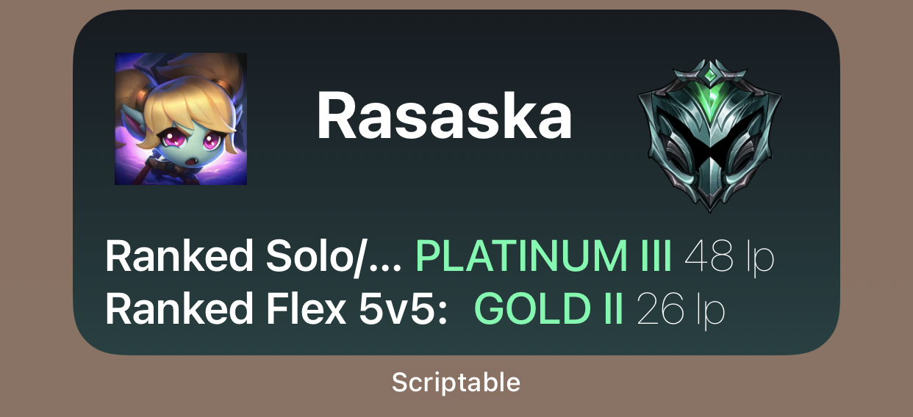
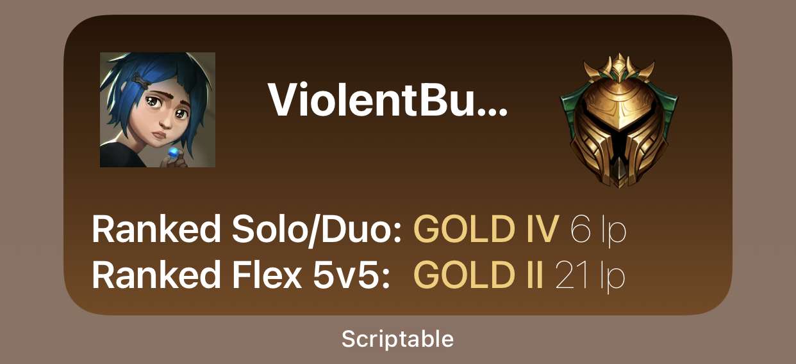

# League of Legends iOS Widget Display
Uses [Scriptable](https://docs.scriptable.app/), an iOS app that allows for the execution of Javascript code to create widgets, alerts and other functions on iOS. It receives a user name (summoner name) of a League of Legends account, makes a pull to the Riot API, and displays information about the user including their user name, rank(s), and icon. 
The Riot API Key resets every 24 hours, so to run this script on your phone you require access to the [Riot API](https://developer.riotgames.com/).

# Example Images

